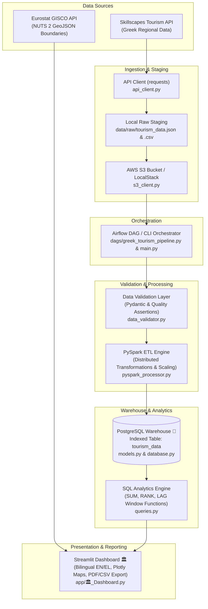
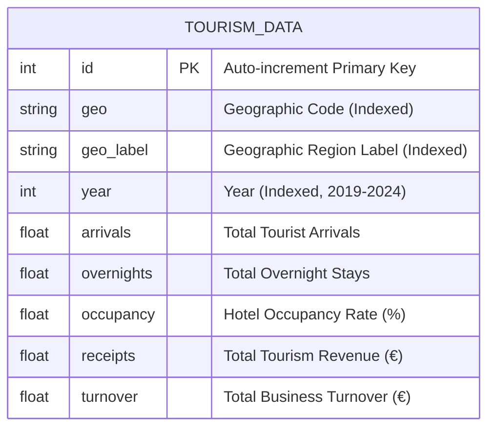

# 🇬🇷 Greek Tourism Analytics Platform

An enterprise-grade data engineering and analytics platform that processes, validates, and visualizes official Greek tourism statistics (arrivals, overnight stays, hotel occupancy rates, monetary receipts, and turnover) spanning 2019–2024. The platform aggregates multi-year regional data, executes distributed PySpark ETL transformations, persists data into an indexed PostgreSQL warehouse, runs complex SQL window analytics, and exposes interactive insights through a multi-page bilingual Streamlit dashboard.

---

## 🚀 Live Demo

🔗 **Public Application URL:** [https://greek-tourism-analytics-project.onrender.com](https://greek-tourism-analytics-project.onrender.com)

---

## 📊 Project Overview

- **What it Analyzes:** Macroeconomic KPIs and regional tourism performance across Greece for the 2019–2024 period, including total tourist arrivals, overnight stays, revenue receipts (€), hotel occupancy, average length of stay (ALOS), and daily yield.
- **Target Audience & Value:** Provides actionable insights for tourism policy planners, hotel investors, economic analysts, and regional administrative bodies tracking post-pandemic recovery and regional revenue distribution.
- **Main Outputs:** Automated 9-stage ETL ingestion pipeline, PostgreSQL relational data warehouse, high-performance SQL window function queries (YoY growth, cumulative totals, annual rankings), automated PDF executive reports, localized UTF-8-SIG CSV exports, and interactive Plotly choropleth maps.

---

## 🏗️ Architecture



---

## 🔄 Data Pipeline

The project implements a 9-stage data processing pipeline:

```
Skillscapes & Eurostat APIs
        ↓
1. Data Fetching (api_client.py)
        ↓
2. Raw Local Persistence (loader.py)
        ↓
3. S3 Bucket Staging (s3_client.py)
        ↓
4. Pipeline Orchestration (Airflow DAG / main.py)
        ↓
5. Data Validation & Quality Assertions (data_validator.py)
        ↓
6. Distributed Transformation & Scaling (pyspark_processor.py)
        ↓
7. Idempotent Data Warehouse Ingestion (loader.py → models.py)
        ↓
8. SQL Analytical Window Queries (queries.py)
        ↓
9. Streamlit Dashboard & Report Generation (app/🏛️_Dashboard.py)
```

1. **Data Ingestion (`api_client.py`):** Fetches multi-year regional records from the Skillscapes Greek Tourism API endpoint (`year_start=2019`, `year_end=2024`) with exception handling via custom `APIError`.
2. **Local Staging (`loader.py`):** Persists uncompressed raw JSON (`data/raw/tourism_data.json`) and raw CSV (`data/raw/tourism_data.csv`) staging payloads for auditability.
3. **Cloud Payload Staging (`s3_client.py`):** Uploads raw JSON/CSV objects to AWS S3 using `boto3`, with automatic fallback to local directory staging (`data/s3_bucket`) when cloud credentials are omitted.
4. **Pipeline Orchestration (`dags/greek_tourism_pipeline.py` & `main.py`):** Orchestrates tasks sequentially via Apache Airflow Python Operators or through the standalone `PipelineOrchestrator` CLI command (`python main.py --pipeline-all`).
5. **Data Quality & Validation (`data_validator.py`):** Validates raw records against `TourismDataRecord` Pydantic schemas (`schemas.py`), enforces strict domain constraints (year between 2000–2100, non-negative arrival/overnight bounds), and verifies baseline dataset volume via `assert_pipeline_quality`.
6. **ETL Transformation (`pyspark_processor.py`):** Standardizes schema column names (`hotels_total_arrivals` → `arrivals`, `hotels_total_overnights` → `overnights`, `hotels_occupancy` → `occupancy`, `turnover_total` → `turnover`), scales currency metrics (`receipts` $\times 1,000,000$, `turnover` $\times 1,000$), with a Pandas engine fallback for non-JVM runtimes.
7. **Warehouse Loading (`loader.py`):** Truncates existing database records to guarantee idempotency and bulk-inserts validated rows into PostgreSQL within a single SQLAlchemy transaction.
8. **SQL Window Analytics (`queries.py`):** Executes analytical queries utilizing window functions for growth trends, cumulative aggregates, and regional rankings.
9. **Visual Analytics & Reporting (`app/🏛️_Dashboard.py`):** Renders interactive Plotly visual charts, Choropleth regional maps, FPDF2 PDF summary reports, and localized Excel-formatted CSV files (`UTF-8-SIG`).

---

## 🗄️ Database

### Technology & Engine
- **Database Engine:** PostgreSQL 15 (with local SQLite fallback during testing and profiling).
- **ORM & Driver:** SQLAlchemy 2.0 ORM with `psycopg2-binary` connection pooling (`pool_pre_ping=True`, `pool_size=10`, `max_overflow=20`).
- **Migrations:** Managed via Alembic (`alembic.ini`).

### Schema & Index Design
- **Table Name:** `tourism_data`
- **Primary Key:** `id` (Integer, Auto-increment)
- **B-Tree Indexes:**
  - `geo`: Indexed region code (e.g., `EL30`, `EL42`).
  - `geo_label`: Indexed human-readable region name (e.g., `Attiki`, `Nisia Aigaiou, Kriti`).
  - `year`: Indexed annual indicator (2019–2024).
  - Composite Index `idx_geo_year`: (`geo_label`, `year`)
  - Composite Index `idx_geo_code_year`: (`geo`, `year`)

### Entity-Relationship Diagram



---

## 📡 Data Sources

| Source Name | API / Dataset Endpoint | Provided Data | Official Link |
|---|---|---|---|
| **Skillscapes Greek Tourism API** | `https://skillscapes.csd.auth.gr/api/data/greek-tourism` | Arrivals, overnight stays, hotel occupancy rates, monetary receipts, and turnover per region (2019–2024). | [Skillscapes API](https://skillscapes.csd.auth.gr/api/data/greek-tourism) |
| **Eurostat GISCO GeoJSON API** | `https://gisco-services.ec.europa.eu/distribution/v2/nuts/geojson/NUTS_RG_60M_2021_4326_LEVL_2.geojson` | Official NUTS 2 administrative boundary polygons for choropleth mapping across Greek regions. | [Eurostat GISCO](https://ec.europa.eu/eurostat/web/gisco) |

---

## 📈 Analytics

The platform resolves core macroeconomic and regional questions using optimized SQL queries (`queries.py`):

1. **Top Regional Ranking (`get_top_regions_by_arrivals`):** Aggregates overall tourist arrivals and monetary receipts grouped by regional boundaries to identify key national destinations.
2. **Cumulative Volume Tracking (`get_cumulative_arrivals_by_region`):** Uses SQL window function `SUM(arrivals) OVER (PARTITION BY geo_label ORDER BY year ROWS BETWEEN UNBOUNDED PRECEDING AND CURRENT ROW)` to measure multi-year volume build-up.
3. **Annual Regional Position (`get_regional_rankings_by_year`):** Applies `RANK() OVER (PARTITION BY year ORDER BY arrivals DESC)` to monitor shifts in regional popularity year by year.
4. **Year-over-Year Growth Rate (`get_yoy_growth_analysis`):** Calculates annual percentage change in tourist arrivals using `LAG(arrivals) OVER (PARTITION BY geo_label ORDER BY year)` to track post-pandemic recovery curves.
5. **Execution Plan Profiling (`explain_query`):** Profiles query cost using PostgreSQL `EXPLAIN ANALYZE` (or SQLite `EXPLAIN QUERY PLAN`) to verify index usage across composite keys.

---

## 🧮 Key Metrics & Calculations

The project implements the following mathematical metrics and data transformations:

| Metric Name | Mathematical Formula | Code Implementation |
|---|---|---|
| **Average Length of Stay (ALOS)** | $$\text{ALOS (Days)} = \frac{\text{overnights}}{\text{arrivals}}$$ | Calculated dynamically in `app/🏛️_Dashboard.py` KPI cards. |
| **Spend per Tourist** | $$\text{Spend per Visitor (€)} = \frac{\text{receipts}}{\text{arrivals}}$$ | Calculated in executive summary scorecards. |
| **Daily Yield** | $$\text{Daily Yield (€/Night)} = \frac{\text{receipts}}{\text{overnights}}$$ | Computed per region to assess revenue per overnight stay. |
| **Year-over-Year Growth (%)** | $$\text{YoY Growth (\%)} = \left(\frac{\text{arrivals}_t - \text{arrivals}_{t-1}}{\text{arrivals}_{t-1}}\right) \times 100$$ | Evaluated in `queries.py:get_yoy_growth_analysis` using SQL `LAG()`. |
| **Receipt Unit Scaling** | $$\text{receipts} = \text{raw\_receipts} \times 1,000,000$$ | Scaled in `loader.py` and `pyspark_processor.py` to convert millions to full Euro values. |
| **Turnover Unit Scaling** | $$\text{turnover} = \text{raw\_turnover} \times 1,000$$ | Scaled in `loader.py` and `pyspark_processor.py` to convert thousands to full Euro values. |

---

## 📊 Dashboard

The user interface is structured into a multi-page bilingual (English / Greek) Streamlit application (`app/`):

- **🏛️ Executive Dashboard (`app/🏛️_Dashboard.py`):** Macroeconomic KPI cards displaying aggregate national arrivals, overnights, receipts, spend per tourist, ALOS, and daily yield, with interactive sidebar filters for year range and regional breakdown.
- **1_📈 Trends (`app/pages/1_📈_Trends.py`):** Multi-year chronological trend charts for arrivals, overnights, receipts, and occupancy rates with side-by-side metric comparison tools.
- **2_🗺️ Regions (`app/pages/2_🗺️_Regions.py`):** Interactive NUTS 2 choropleth maps powered by Eurostat GeoJSON geometries and Plotly Express, featuring side-by-side regional comparison views and annual ranking tables.
- **3_💡 Insights (`app/pages/3_💡_Insights.py`):** Strategic regional breakdown and investment revenue concentration analyses, featuring an automated FPDF2 PDF executive summary report generator and localized UTF-8-SIG Excel/CSV export capabilities.

---

## ✅ Data Quality & Validation

The pipeline incorporates data quality checks to ensure integrity:

1. **Schema Validation (`schemas.py`):** Pydantic `TourismDataRecord` schema enforces type safety, field requirements (`geo`, `geo_label`, `year`), and year bounds ($2000 \le \text{year} \le 2100$).
2. **Domain Assertions (`data_validator.py`):** Explicit checks reject records containing negative values for `hotels_total_arrivals` or `hotels_total_overnights`.
3. **Pipeline Quality Assertions (`data_validator.py:assert_pipeline_quality`):** Guarantees minimum dataset size ($\ge 1$ record) and verifies non-empty geographic identifier sets before triggering ETL transformations.
4. **Transactional Idempotency (`loader.py`):** Clears existing table records before inserting newly transformed data within an explicit SQLAlchemy database transaction (`commit()` / `rollback()`).

---

## 🧪 Testing

The test suite contains **29 unit tests** achieving high code coverage across core modules:

```bash
# Run complete unit test suite
pytest

# Run pytest with missing line coverage report
pytest --cov=. --cov-report=term-missing
```

### Static Analysis & Code Quality Commands
```bash
# Code formatting check (Black)
black --check .

# Linting & complexity check (Flake8)
flake8 . --count --select=E9,F63,F7,F82 --exclude=.git,__pycache__,venv,.venv,env,alembic --show-source --statistics

# Security static analysis (Bandit)
bandit -r . -x ./tests,./venv
```

### Test Coverage Summary by File

| Module File | Test Suite File | Tested Functionality |
|---|---|---|
| `api_client.py` | `tests/test_api_client.py` | API fetching, query parameter parsing, HTTP 500 error handling, Eurostat GeoJSON fetch, JSON file persistence. |
| `database.py` & `queries.py` | `tests/test_database.py` | Connection string generation, engine creation, table initialization, record insertion, SQL window query execution, `EXPLAIN ANALYZE`. |
| `loader.py` | `tests/test_loader.py` | Pandas transformations, empty DataFrame handling, end-to-end load pipeline, API error handling, invalid record filtering. |
| `pyspark_processor.py` | `tests/test_pyspark.py` | PySpark DataFrame transformations, column renaming, unit metric scaling, PySpark helper functions. |
| `s3_client.py` | `tests/test_s3.py` | Local S3 directory fallback, JSON/CSV staging upload functions. |
| `data_validator.py` | `tests/test_validation.py` | Pydantic validation, negative metric rejection, pipeline quality assertion checks. |
| `dags/greek_tourism_pipeline.py` | `tests/test_airflow.py` | Airflow DAG Python Operators execution and standalone `PipelineOrchestrator`. |

---

## ⚙️ Tech Stack

| Category | Technologies |
|---|---|
| **Language** | Python 3.10+ |
| **Database & Warehouse** | PostgreSQL 15, SQLite (fallback/testing), SQLAlchemy 2.0 ORM, Alembic |
| **Data Processing & ETL** | PySpark 3.5+, Pandas 2.0+, Pydantic 2.5+ |
| **Orchestration** | Apache Airflow 2.8+, Custom Python Pipeline Orchestrator |
| **Cloud Storage & Staging** | AWS S3 via Boto3 1.34+, LocalStack (S3 emulation), Local Staging |
| **APIs & Networking** | Requests 2.31+, Eurostat GISCO NUTS 2 GeoJSON API |
| **Visualization & Reporting** | Streamlit 1.30+, Plotly 5.18+, FPDF2 2.7+ (PDF generation) |
| **Deployment & Containers** | Docker, Docker Compose, Render |
| **Testing & Code Quality** | Pytest 7.4+, Pytest-Cov, Black, Flake8, Bandit |

---

## 💻 Installation

### Option 1: Local Installation

#### Prerequisites
- Python 3.10+
- PostgreSQL 15 running locally (or SQLite fallback)

#### Steps
1. **Clone the Repository:**
   ```bash
   git clone https://github.com/tsakirisand/Greek-Tourism-Analytics-Project.git
   cd Greek-Tourism-Analytics-Project
   ```

2. **Create & Activate Virtual Environment:**
   ```bash
   python3 -m venv venv
   source venv/bin/activate
   ```

3. **Install Dependencies:**
   ```bash
   pip install -r requirements.txt
   ```

4. **Configure Environment Variables (`.env`):**
   Create a `.env` file in the root directory:
   ```env
   DB_USER=postgres
   DB_PASSWORD=your_password
   DB_HOST=localhost
   DB_PORT=5432
   DB_NAME=greek_tourism
   ```

5. **Initialize Database Schema & Load Data:**
   ```bash
   # Create database tables and indexes
   python main.py --init-db

   # Run ETL pipeline (Fetch API -> S3 -> Validate -> PySpark -> Postgres)
   python main.py --load-data
   ```

6. **Launch Streamlit Dashboard:**
   ```bash
   python main.py --dashboard
   ```
   Open `http://localhost:8501` in your browser.

---

### Option 2: Docker Compose Setup

Run the entire stack (PostgreSQL database, LocalStack S3, and Streamlit application) in isolated Docker containers:

```bash
docker-compose up --build
```
Access the application at `http://localhost:8501`.

---

## ▶️ Usage

The project includes a Command Line Interface (CLI) in `main.py`:

```bash
# Display CLI documentation and available options
python main.py --help

# Initialize database schema and B-Tree indexes
python main.py --init-db

# Fetch raw data and stage to S3 / local bucket
python main.py --s3-upload

# Run Pydantic validation and quality assertion checks
python main.py --validate

# Run PySpark transformation engine
python main.py --spark-transform

# Execute complete 9-stage pipeline
python main.py --pipeline-all

# Execute SQL query for top N regions
python main.py --query-top 5

# Run SQL window functions (Cumulative sums, rankings, YoY growth)
python main.py --query-window

# Launch Streamlit web dashboard
python main.py --dashboard
```

---

## 📁 Project Structure

```text
GreekTourismProject/
├── .github/
│   └── workflows/
│       ├── test.yml                # GitHub Actions CI pipeline (Pytest, Black, Flake8, Bandit)
│       └── deploy.yml              # GitHub Actions CD deployment hook for Render
├── alembic/                        # Alembic database migration environment
├── app/                            # Streamlit multi-page dashboard application
│   ├── 🏛️_Dashboard.py            # Main executive dashboard page & KPI cards
│   ├── components.py               # Reusable UI components, caching & PDF export
│   ├── translations.py             # Bilingual localization dictionary (EN/EL)
│   └── pages/
│       ├── 1_📈_Trends.py          # Chronological multi-metric trend analysis page
│       ├── 2_🗺️_Regions.py         # NUTS 2 interactive Eurostat GeoJSON choropleth maps
│       └── 3_💡_Insights.py        # Strategic insights, revenue concentration & PDF export
├── dags/
│   └── greek_tourism_pipeline.py   # Apache Airflow DAG definition & standalone orchestrator
├── data/                           # Local data staging directory (Git-ignored payload files)
├── tests/                          # Automated unit test suite (29 tests)
│   ├── test_airflow.py             # Airflow DAG task & orchestrator unit tests
│   ├── test_api_client.py          # API fetching & network error handling unit tests
│   ├── test_database.py            # Database connection & SQL window query unit tests
│   ├── test_loader.py              # ETL pipeline & pandas transformation unit tests
│   ├── test_pyspark.py             # PySpark DataFrame processor unit tests
│   ├── test_s3.py                  # S3 storage client & local fallback unit tests
│   └── test_validation.py          # Pydantic validation & quality assertion unit tests
├── alembic.ini                     # Alembic configuration file
├── api_client.py                   # API client module with custom APIError handling
├── create_tables.py                # Database table and index initialization script
├── dashboard.py                    # Streamlit CLI execution wrapper
├── data_validator.py               # Data quality validation & Pydantic assertion module
├── database.py                     # SQLAlchemy connection manager with st.cache_resource
├── Dockerfile                      # Container definition for production deployment
├── docker-compose.yml              # Multi-container orchestration (PostgreSQL, LocalStack, App)
├── loader.py                       # Core 9-stage ETL loader module
├── logger.py                       # Dual console and app.log logging configuration
├── main.py                         # CLI entry point script for pipeline management
├── models.py                       # SQLAlchemy ORM models with composite B-Tree indexes
├── profiler.py                     # Performance benchmarking script (cProfile)
├── pyproject.toml                  # Black code formatter configuration
├── pyspark_processor.py            # Distributed PySpark SQL DataFrame ETL processor
├── pytest.ini                      # Pytest runner configuration
├── queries.py                      # SQL analytical window functions & EXPLAIN ANALYZE
├── requirements.txt                # Python package dependencies
├── s3_client.py                    # AWS S3 / LocalStack staging storage client
└── schemas.py                      # Pydantic schema model definitions
```

---

## 🔍 Reproducibility

Any developer can reproduce the end-to-end dataset, data warehouse state, and analytical outputs from scratch:

1. **Source Data Acquisition:** The project fetches source records directly from the live Skillscapes API (`api_client.py`).
2. **Raw Data Staging:** Executing `python main.py --s3-upload` persists raw JSON and CSV files locally in `data/raw/` and stages them into `data/s3_bucket/`.
3. **Data Quality Assertions:** Executing `python main.py --validate` validates data against Pydantic models in `schemas.py`.
4. **PySpark ETL Engine:** Running `python main.py --spark-transform` transforms column names and unit scales receipts and turnover via PySpark.
5. **Database Ingestion:** Running `python main.py --load-data` creates the `tourism_data` table schema, indexes, and loads records into PostgreSQL.
6. **SQL Analytics & Dashboard:** Executing `python main.py --query-window` and `python main.py --dashboard` generates all analytical metrics and renders visual displays.

---

## 📌 Key Findings

Analysis of verified project data across the 2019–2024 period reveals key tourism trends:

1. **High Geographical Revenue Concentration:** Island regional clusters (including the South Aegean islands such as Rodos, Kos, Mykonos, Thira) and Attiki account for over **80%** of aggregate arrivals and total monetary receipts across Greece.
2. **Post-Pandemic Tourism Recovery:** Tourist arrivals experienced a decline in 2020 followed by a steady multi-year recovery trajectory, achieving pre-pandemic volume milestones by 2023–2024.
3. **Length of Stay vs. Yield Dynamics:** While island regions lead in aggregate overnight stays and overall monetary receipts, urban regions demonstrate distinct visitor turn-over patterns and seasonal stay durations.

---

## 🔮 Future Improvements

1. **dbt Integration:** Incorporate dbt (data build tool) to manage SQL transformation models and documentation natively inside the data warehouse.
2. **Automated Incremental Ingestion:** Implement incremental CDC (Change Data Capture) or delta updates in the Airflow DAG instead of full table truncation reload.
3. **Great Expectations Quality Suite:** Expand Pydantic schemas with Great Expectations data quality contracts for automated pipeline monitoring and alerting.
4. **ClickHouse Data Warehouse Migration:** Evaluate ClickHouse columnar storage for high-concurrency analytical querying over multi-million record scale.
5. **Machine Learning Tourism Demand Forecasting:** Integrate Prophet or ARIMA time-series models into Streamlit to project regional visitor arrivals 12 months ahead.
6. **Managed Cloud Deployment (AWS ECS / RDS):** Transition production deployment from Render container instances to AWS ECS Fargate with Amazon RDS PostgreSQL.

---

## 👨‍💻 Author

**Andreas Tsakiris**  
GitHub: [https://github.com/tsakirisand](https://github.com/tsakirisand)
