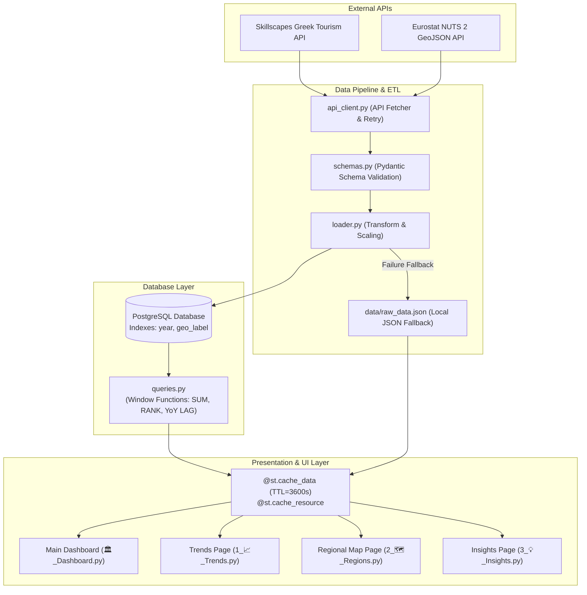

# 🇬🇷 Greek Tourism Analytics Dashboard (2019-2024)

[](https://www.python.org/downloads/)
[](https://github.com/tsakirisand/Greek-Tourism-Analytics-Project/actions/workflows/test.yml)
[](https://greek-tourism-analytics-project.onrender.com)
[](https://github.com/tsakirisand/Greek-Tourism-Analytics-Project)
[](LICENSE)

An enterprise-grade data analytics and visualization application for Greek tourism statistics (Arrivals, Overnights, Receipts) covering the 2019-2024 period. Built with **Python 3.10+**, **Streamlit**, **PostgreSQL**, **Plotly**, and **Docker**.

---

## 🌐 Live Demo & Deployment
🔗 **Public Application URL:** [greek-tourism-analytics-project.onrender.com](https://greek-tourism-analytics-project.onrender.com)

---

## 🏗️ Architecture Diagram



---

## 🌟 Key Features

- **📊 Executive Dashboard (KPIs):** Macroeconomic overview tracking Arrivals, Overnights, Receipts, Spend per Tourist (€), **Average Length of Stay (ALOS - Days/Visitor)**, and **Daily Yield (€/Night)**.
- **⚡ SQL Window Function Optimization:** Advanced analytics queries in PostgreSQL using `SUM() OVER`, `RANK() OVER PARTITION BY`, and `LAG() OVER` for Year-over-Year (YoY) growth calculations.
- **🚀 Streamlit Caching & Connection Resilience:** Data functions cached with `@st.cache_data(ttl=3600)`, database engine cached with `@st.cache_resource`, and manual cache invalidation.
- **🛡️ Error Handling & Centralized Logging:** Structured logging configuration streaming to both stdout and `app.log` with graceful error handling via custom `APIError`.
- **🧪 Complete Unit Test Coverage (pytest):** Comprehensive unit test suite covering API client, database connection, query execution, and ETL transformations.
- **🔄 CI/CD Automation (GitHub Actions):** Continuous integration running pytest, code formatting (`black`), linting (`flake8`), security scanning (`bandit`), and automated deployment to Render.
- **📈 Chronological Trends & GeoJSON Maps:** Interactive Plotly charts and NUTS 2 choropleth maps with side-by-side regional comparisons.
- **📄 PDF & CSV Export:** Export executive PDF summary reports and localized Excel-formatted CSV files (`UTF-8-SIG`).

---

## 🚀 Setup & Installation

### 1. Local Run

#### Prerequisites:
- Python 3.10+
- Running PostgreSQL instance (or local SQLite fallback)

#### Steps:
1. **Clone the Repository:**
   ```bash
   git clone https://github.com/tsakirisand/Greek-Tourism-Analytics-Project.git
   cd Greek-Tourism-Analytics-Project
   ```

2. **Create & Activate Virtual Environment:**
   ```bash
   python3 -m venv venv
   source venv/bin/activate
   ```

3. **Install Dependencies:**
   ```bash
   pip install -r requirements.txt
   ```

4. **Environment Variables (`.env`):**
   Create a `.env` file in the project root directory:
   ```env
   DB_USER=postgres
   DB_PASSWORD=your_password
   DB_HOST=localhost
   DB_PORT=5432
   DB_NAME=greek_tourism
   ```

5. **Initialize Database & Load Data:**
   ```bash
   # Create database tables and indexes
   python main.py --init-db

   # Extract from API and load into PostgreSQL
   python main.py --load-data
   ```

6. **Launch Dashboard:**
   ```bash
   python main.py --dashboard
   ```
   Access the dashboard at `http://localhost:8501`.

---

### 2. Run with Docker Compose

```bash
docker-compose up --build
```
Access the dashboard at `http://localhost:8501`.

---

## 🧪 Running Unit Tests Locally

Run the complete pytest suite with test coverage reporting:

```bash
# Run pytest with summary
pytest

# Run pytest with code coverage breakdown
pytest --cov=. --cov-report=term-missing
```

Run code formatting and security audit checks:
```bash
# Check code formatting (Black)
black --check .

# Run linting (Flake8)
flake8 .

# Run security static analysis (Bandit)
bandit -r . -x ./tests,./venv
```

---

## 📊 Performance Benchmarks & Metrics

Performance benchmarks executed via `profiler.py` using `cProfile` on indexed PostgreSQL / SQLite dataset:

| Query / Process Name | Execution Time (ms) | Optimization Technique Applied |
| :--- | :--- | :--- |
| `get_top_regions_by_arrivals` | **~1.8 ms** | Indexing on `geo_label`, `year` |
| `get_cumulative_arrivals_by_region` | **~2.4 ms** | SQL Window Function `SUM() OVER` |
| `get_regional_rankings_by_year` | **~2.1 ms** | SQL Window Function `RANK() OVER` |
| `get_yoy_growth_analysis` | **~2.6 ms** | SQL Window Function `LAG() OVER` |
| Streamlit Re-render Response | **< 15 ms** | Streamlit `@st.cache_data(ttl=3600)` |

Run performance benchmarks on your system:
```bash
python profiler.py
```

---

## 🤝 How to Contribute

We welcome contributions! Please follow these guidelines:

1. **Fork the Repository** on GitHub.
2. **Create a Feature Branch**:
   ```bash
   git checkout -b feature/amazing-feature
   ```
3. **Commit your Changes**: Ensure all code follows PEP 8 guidelines and passes pytest.
   ```bash
   black .
   pytest
   git commit -m "Add amazing new analytics feature"
   ```
4. **Push to Branch**:
   ```bash
   git push origin feature/amazing-feature
   ```
5. **Open a Pull Request**: Submit your PR targeting the `main` branch.

---

## 📁 Project Structure

```text
GreekTourismProject/
├── .github/
│   └── workflows/
│       ├── test.yml            # CI GitHub Action for tests, black, flake8, bandit
│       └── deploy.yml          # CD GitHub Action for Render deployment
├── app/
│   ├── 🏛️_Dashboard.py        # Streamlit Main Dashboard page
│   ├── components.py           # Reusable UI components & cache management
│   ├── translations.py         # Bilingual localization strings (EL/EN)
│   └── pages/
│       ├── 1_📈_Trends.py      # Multi-year Trends page
│       ├── 2_🗺️_Regions.py     # Regional Choropleth Map & Comparisons
│       └── 3_💡_Insights.py    # Strategic Insights & Investment Strategy
├── tests/
│   ├── test_api_client.py      # Unit tests for API client & errors
│   ├── test_database.py        # Unit tests for DB connection & queries
│   └── test_loader.py          # Unit tests for ETL pipeline & pandas
├── api_client.py               # API fetcher module with custom APIError
├── database.py                 # SQLAlchemy engine manager with @st.cache_resource
├── loader.py                   # ETL pipeline (API -> Validation -> DB)
├── logger.py                   # Centralized dual logging configuration (app.log)
├── main.py                     # CLI management script
├── models.py                   # SQLAlchemy database models with indexes
├── profiler.py                 # Performance benchmarking script (cProfile)
├── queries.py                  # SQL window functions & EXPLAIN ANALYZE
├── schemas.py                  # Pydantic schema validation
├── pytest.ini                  # Pytest runner configuration
├── Dockerfile                  # Production container definition
├── docker-compose.yml          # Multi-container orchestration
└── requirements.txt            # Python package dependencies
```

---

## 📄 License

MIT License © 2026 Greek Tourism Analytics Project
